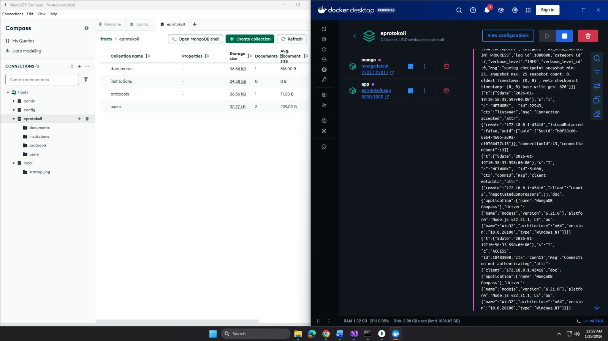
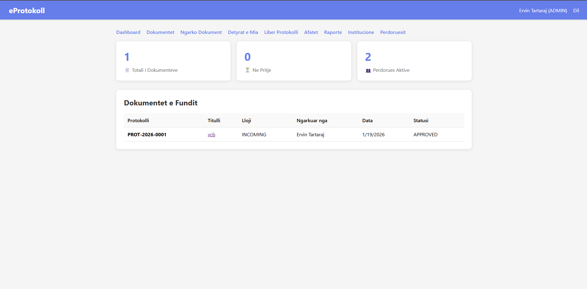
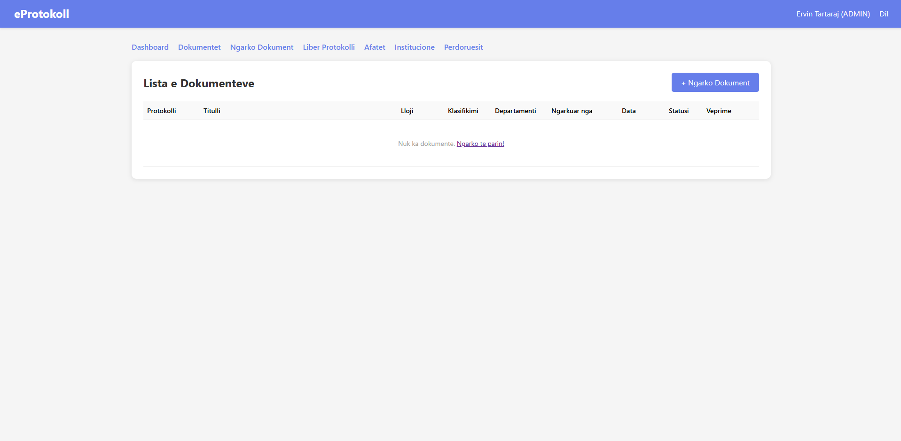

# eProtokoll

Sistem per menaxhimin e dokumenteve me numerim protokolli.

## Pershkrimi

Aplikacion web qe mundeson regjistrimin dhe gjurmimin e dokumenteve zyrtare me numerim automatik protokolli.

## Funksionalitetet

- Regjistrim dokumentesh (hyrje, dalje, brendshme)
- Numerim automatik protokolli
- Klasifikim dokumentesh
- Menaxhim perdoruesish (Admin, Menaxher, Punonjes)
- Delegim dhe gjurmim dokumentesh
- Afate per pergjigje
- Liber protokolli
- Raporte

## Teknologjite

- Node.js
- Express
- MongoDB
- EJS
- Docker

## Tools

- VS Code
- MongoDB Compass
- Docker Desktop



## Instalimi

```
npm install
docker-compose up --build
node seed.js
```

Hapet ne http://localhost:3000

## Perdorimi

```
Username: administrator
Password: admin123
```

## Screenshots






## Struktura

```
eprotokoll/
├── models/
│   ├── Document.js
│   ├── Institution.js
│   ├── Protocol.js
│   └── User.js
├── routes/
│   ├── auth.js
│   ├── dashboard.js
│   ├── documents.js
│   ├── institutions.js
│   └── users.js
├── views/
│   ├── documents/
│   │   ├── assigned-to-me.ejs
│   │   ├── deadlines.ejs
│   │   ├── delegate.ejs
│   │   ├── list.ejs
│   │   ├── protocol-book.ejs
│   │   ├── statistics.ejs
│   │   ├── tracking-history.ejs
│   │   ├── upload.ejs
│   │   └── view.ejs
│   ├── institutions/
│   │   ├── add.ejs
│   │   ├── edit.ejs
│   │   └── list.ejs
│   ├── users/
│   │   ├── add.ejs
│   │   ├── edit.ejs
│   │   └── list.ejs
│   ├── dashboard.ejs
│   └── login.ejs
├── uploads/
├── public/
├── index.js
├── seed.js
├── package.json
├── Dockerfile
└── docker-compose.yml
```

Ervin Tartaraj - 2026
